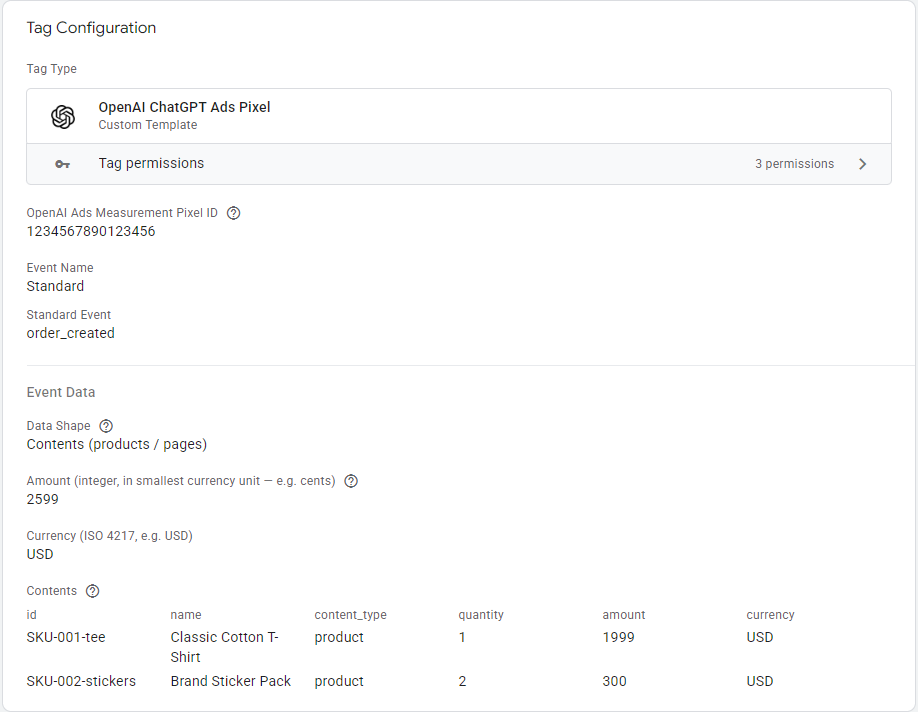
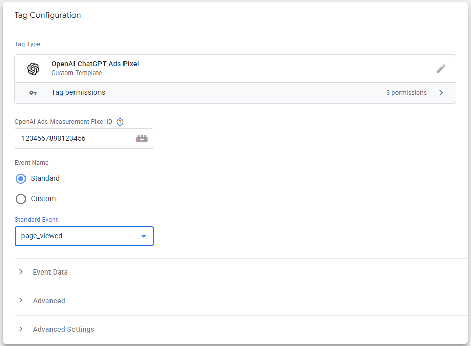
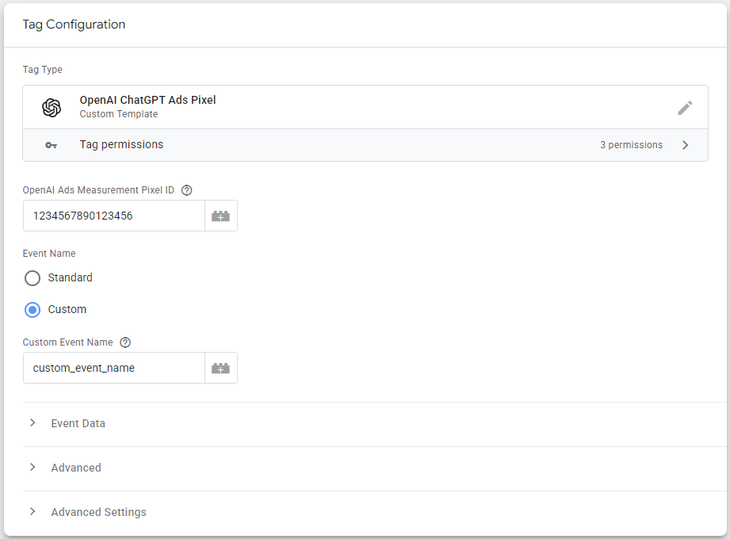

# OpenAI ChatGPT Ads Pixel — Google Tag Manager Web Custom Tag Template

A Google Tag Manager custom tag template for the [OpenAI ChatGPT Ads measurement pixel](https://developers.openai.com/ads/measurement-pixel). Handles SDK loading and pixel initialization automatically, and fires standard or custom events with built-in deduplication support.

My goal was to make this tag template as simple as possible to use. The same template handles everything from the initial pixel fire to individual conversion events.

<p align="center">
  
</p>
<p align="center"><em>The tag configuration UI in Google Tag Manager, showing an order_created event with a Contents data shape.</em></p>

## Features

- Loads the OpenAI measurement SDK (`oaiq.min.js`) automatically, only once per page
- Initializes the pixel on every tag fire (no separate init/page view tag required)
- All documented standard events available from a dropdown
- Custom events available
- Three data shapes: Contents, Customer Action, Plan Enrollment
- Event ID field for browser/server-side conversion deduplication
- Optional debug mode

## Installation

### From the Community Gallery

Once approved, search for **OpenAI ChatGPT Ads Pixel** in the GTM template gallery and click **Add to workspace**.

### Manual install

1. Download [`template.tpl`](template.tpl) from this repo.
2. In GTM, go to **Templates → Tag Templates → New**.
3. Click the three-dot menu in the top right and choose **Import**.
4. Select `template.tpl`, then **Save**.

You can now create tags using **Custom → OpenAI ChatGPT Ads Pixel**.

## Configuration

### Required fields

| Field | Description |
|---|---|
| OpenAI Ads Measurement Pixel ID | Created in the Conversions tab of OpenAI Ads Manager. |
| Event Name | Choose **Standard** (with documented events) or **Custom**. |

### Standard events

- `page_viewed`
- `appointment_scheduled`
- `checkout_started`
- `contents_viewed`
- `items_added`
- `lead_created`
- `order_created`
- `registration_completed`
- `subscription_created`
- `trial_started`

### Data shapes

| Shape | Use for | Required fields |
|---|---|---|
| Contents | Product or page interactions, carts, orders | Contents table (id, name, content_type, quantity, amount, currency) |
| Customer Action | Leads, registrations, appointments | None (amount and currency optional) |
| Plan Enrollment | Subscriptions, trials | Plan ID (amount and currency optional) |

`amount` and `quantity` must be integers in the smallest currency unit. For example, `2599` represents $25.99 USD.

### Advanced fields

| Field | Description |
|---|---|
| Event ID | Optional. Used to deduplicate browser and server-side events. The pixel deduplicates on Pixel ID + event name + Event ID. If omitted, the SDK auto-generates one. |
| Debug mode | Logs SDK activity to the browser console. Useful while configuring; turn off in production. |

## Usage examples

### Page view on all pages

```
Pixel ID: 1234567890
Event Name: Standard → page_viewed
Trigger: All Pages
```

<p align="center">
  
</p>
<p align="center"><em>The tag configuration UI in Google Tag Manager, showing a page_viewed standard event.</em></p>


### Ecommerce purchase

```
Pixel ID: 1234567890
Event Name: Standard → order_created
Data Shape: Contents
Amount: {{DLV - ecommerce.value_in_cents}}
Currency: {{DLV - ecommerce.currency}}
Contents:
  id={{DLV - item_id}}, name={{DLV - item_name}}, content_type=product,
  quantity={{DLV - item_quantity}}, amount={{DLV - item_price_in_cents}},
  currency={{DLV - ecommerce.currency}}
Event ID: {{DLV - transaction_id}}
Trigger: Custom Event "purchase"
```

### Lead form submission

```
Pixel ID: 1234567890
Event Name: Standard → lead_created
Data Shape: Customer Action
Trigger: Form Submission on /contact/
```

### Subscription signup

```
Pixel ID: 1234567890
Event Name: Standard → subscription_created
Data Shape: Plan Enrollment
Plan ID: pro_monthly
Amount: 1499
Currency: USD
Event ID: {{DLV - subscription_id}}
```

### Custom event

```
Pixel ID: 1234567890
Event Name: Custom
Custom Event Name: quote_requested
Data Shape: Customer Action
Event ID: quote_{{DLV - quote_id}}
```

<p align="center">
  
</p>
<p align="center"><em>The tag configuration UI in Google Tag Manager, showing custom_event_name custom event.</em></p>


## Server-side deduplication

If you also fire conversions server-side (e.g. via OpenAI's Conversions API), supply the **same Event ID** on both the browser and server calls. The pixel deduplicates on:

```
Pixel ID + event name + event_id
```

For custom events, the deduplication key uses `custom_event_name` instead of the event name, so reuse the same `custom_event_name` and `event_id` on both sides.

## Permissions

The template requests three permissions:

| Permission | Why |
|---|---|
| **Inject script** (`https://bzrcdn.openai.com/sdk/oaiq.min.js`) | Loads OpenAI's hosted measurement SDK. The pixel cannot send data without this. |
| **Access globals** (`oaiq`, `oaiq.q`) | `oaiq` is the SDK's command queue function (created by the template, later replaced by the SDK itself). `oaiq.q` is the array used to buffer calls until the SDK finishes loading. Both are part of the documented OpenAI installation pattern. |
| **Log to console** (debug environment only) | Logs a single error if the SDK fails to load. |

## Privacy and data

This template loads OpenAI's hosted SDK from `bzrcdn.openai.com`. The SDK transmits conversion data to OpenAI according to their published privacy policy.

The current OpenAI measurement pixel documentation does not expose explicit consent or GDPR parameters, so the template does not include consent fields. Use GTM's built-in [consent settings](https://support.google.com/tagmanager/answer/10718549) or trigger conditions to gate this tag according to your consent management platform.

## Compatibility

- Google Tag Manager Web container
- OpenAI ChatGPT Ads measurement pixel (`oaiq.min.js`)
- Documented against the OpenAI pixel reference as of the version listed in [`template.tpl`](template.tpl)

## Development

### Running the tests

The template ships with seven test scenarios covering all major code paths. To run them:

1. In GTM, open **Templates → Tag Templates → OpenAI ChatGPT Ads Pixel**.
2. Click the **Tests** tab.
3. Click **Run tests**.

All seven scenarios should pass. The tests cover:

- Standard `page_viewed` event (init + measure fire correctly)
- `order_created` with a full Contents payload (integer coercion, contents array preserved)
- Custom event (`custom_event_name` and `event_id` in options)
- `plan_enrollment` with `plan_id`
- Debug flag passed to `init`
- SDK only injected once across multiple tag fires
- Empty contents array omitted from payload

### Reporting issues

Issues, suggestions and pull requests are welcome on the [issue tracker](https://github.com/ditomaso/openai-chatgpt-ads-pixel-tag/issues).

## License

Apache 2.0. See [LICENSE](LICENSE).

## Credits

Built by [Dana DiTomaso](https://www.linkedin.com/in/danaditomaso/) at [Kick Point](https://kickpoint.ca).

## Resources

- [OpenAI Ads Measurement Pixel documentation](https://developers.openai.com/ads/measurement-pixel)
- [OpenAI Ads Supported Events documentation](https://developers.openai.com/ads/supported-events)
- [GTM Community Template Gallery](https://tagmanager.google.com/gallery/)
- [GTM Custom Templates documentation](https://developers.google.com/tag-platform/tag-manager/templates)
